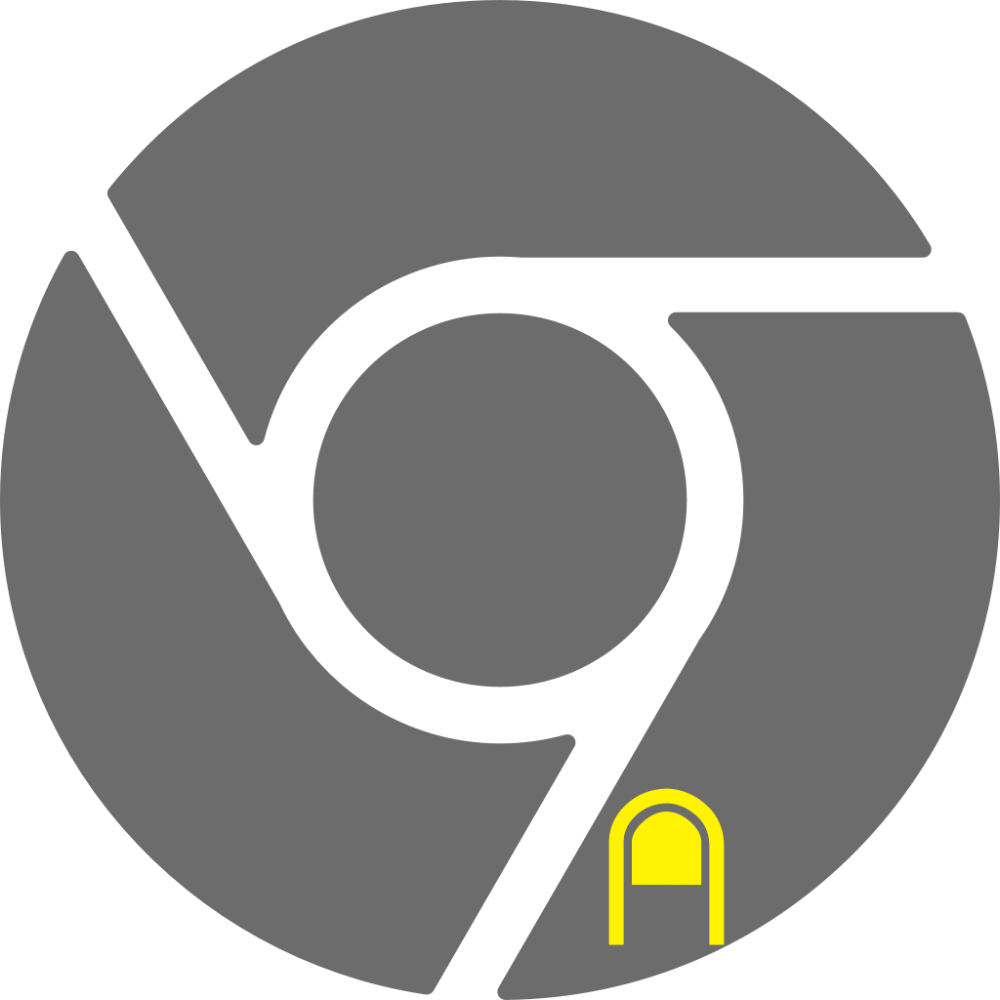

<h1>ChromeCognito </h1> 

A simple AppleScript script to open a new Google Chrome window in incognito mode with a specific user profile.

**Note:** You'll have to play around with the ```--profile-directory``` argument to open the window with the desired user profile. There's no option to put the name in the profile.

<h3>ChromeCognito with Tunnelblick VPN </h3>

An additional script which asks if you want to connect to a VPN configuration using Tunnelblick before the window opens.

**Note:** You'll want to change the ```vpn_configuration_name``` in the script to whatever name you've given your desired configuration on Tunnelblick.

I've uploaded two custom icons (in resources) that I designed for fun; you can save the script as a .app file and run it like you would any other application. Now it has a cool icon to boot xD

<h3>Instructions for saving as an application</h3>
```File``` > ```Export``` > Choose name, location and ```File Format: Application```.
In my case I haven't configured any other options while saving as the package runs well for me as I've described above, but feel free to play around!